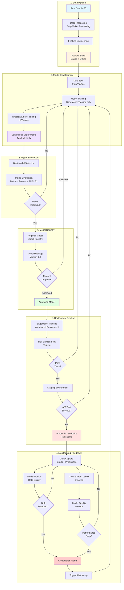

# MLOps: CI/CD & Model Registry

**Tags:** `#core` `#important` `#exam-tip`

## Overview
CI/CD for Machine Learning automates the process of building, testing, and deploying ML models through repeatable pipelines.

## Complete MLOps Pipeline `#important`

### End-to-End ML Pipeline Flow



### Pipeline Components Mapping to AWS Services

| Stage | AWS Service | Purpose |
|-------|-------------|---------|
| **Data Ingestion** | S3, Kinesis, Glue | Collect and store raw data |
| **Data Processing** | SageMaker Processing, EMR, Glue | Clean, transform, feature engineering |
| **Feature Store** | SageMaker Feature Store | Centralized feature repository |
| **Training** | SageMaker Training Jobs | Train models at scale |
| **Experiment Tracking** | SageMaker Experiments | Track all training runs |
| **Hyperparameter Tuning** | SageMaker HPO | Optimize hyperparameters |
| **Model Registry** | SageMaker Model Registry | Version and approve models |
| **CI/CD Pipeline** | SageMaker Pipelines, CodePipeline | Automate workflow |
| **Deployment** | SageMaker Endpoints | Host models for inference |
| **Monitoring** | SageMaker Model Monitor, CloudWatch | Detect drift and performance issues |

## Model Registry & Versioning `#important`

### SageMaker Model Registry
**Purpose:** Catalog and manage model versions

**Features:**
- **Model versioning** - Track all model versions
- **Model approval workflow** - Pending → Approved → Rejected
- **Metadata tracking** - Training metrics, lineage, artifacts
- **Model lineage** - Trace data → training → model → endpoint
- **Integration:** CI/CD pipelines, automated deployment

**Model Package Groups:**
- Group related model versions
- Approve/reject for production
- Track model performance over time

**Approval Status:** `#exam-tip`
- **PendingManualApproval** - Awaiting review
- **Approved** - Ready for production deployment
- **Rejected** - Not suitable for production

## CI/CD for ML `#exam-tip`

### SageMaker Pipelines
**Purpose:** Orchestrate end-to-end ML workflows

**Components:**
- **Pipeline steps:**
  - Processing (data prep, feature engineering)
  - Training (model training)
  - Tuning (hyperparameter optimization)
  - Model evaluation
  - Conditional execution
  - Model registration
- **Parameters** - Configurable pipeline inputs
- **Caching** - Skip unchanged steps
- **Execution tracking** - Monitor pipeline runs

**Use Cases:**
- Automate retraining on new data
- A/B testing workflows
- Model validation before deployment
- Reproducible ML workflows

**Integration:**
- Trigger via EventBridge, Lambda, Step Functions
- Git integration for version control
- Model Registry for deployment

### SageMaker Projects `#exam-tip`
**Purpose:** MLOps templates for common workflows

**Pre-built Templates:**
- Model building, training, deployment
- Model deployment with CI/CD
- Multi-account deployment
- Uses CloudFormation, CodePipeline, CodeBuild

**Components:**
- **Source control** - CodeCommit/GitHub
- **Build** - CodeBuild for training/deployment
- **Deploy** - CodePipeline for staging/production
- **Monitoring** - Automatic setup

### SageMaker Operators for Kubernetes `#exam-tip`
**Purpose:** Manage SageMaker jobs from Kubernetes clusters (EKS)

**Overview:**
- **What it does:** Lets you use Kubernetes to orchestrate SageMaker training, tuning, and inference
- **How it works:** Install Kubernetes custom resource definitions (CRDs) that map to SageMaker APIs
- **Use case:** Teams already using Kubernetes who want to leverage SageMaker's managed ML capabilities

**Key Features:**
- Manage SageMaker resources using `kubectl` commands
- Define SageMaker jobs in YAML manifests
- Native Kubernetes integration (pods, services, ConfigMaps)
- Monitor jobs via Kubernetes dashboard

**Supported Operations:**
1. **Training Jobs** - Define training jobs as Kubernetes resources
2. **Hyperparameter Tuning Jobs** - Run HPO from Kubernetes
3. **Batch Transform Jobs** - Batch inference orchestration
4. **Hosting Endpoints** - Deploy and manage SageMaker endpoints

**Example Kubernetes Manifest:**
```yaml
apiVersion: sagemaker.aws.amazon.com/v1
kind: TrainingJob
metadata:
  name: xgboost-training
spec:
  algorithmSpecification:
    trainingImage: xgboost-container-image
  roleArn: arn:aws:iam::123456789012:role/SageMakerRole
  inputDataConfig:
    - channelName: train
      dataSource:
        s3DataSource:
          s3Uri: s3://bucket/train
  outputDataConfig:
    s3OutputPath: s3://bucket/output
  resourceConfig:
    instanceType: ml.m5.xlarge
    instanceCount: 1
    volumeSizeInGB: 30
```

**When to Use:**
- ✅ Team already uses Kubernetes/EKS for infrastructure
- ✅ Want unified orchestration (SageMaker + other workloads in K8s)
- ✅ Leverage existing Kubernetes expertise and tooling
- ✅ Need to integrate SageMaker into existing K8s CI/CD pipelines

**When NOT to Use:**
- ❌ No existing Kubernetes infrastructure (use SageMaker Pipelines instead)
- ❌ Team unfamiliar with Kubernetes (adds complexity)
- ❌ Simple ML workflows (SageMaker Pipelines is simpler)

**Comparison with SageMaker Pipelines:**

| Aspect | SageMaker Operators for K8s | SageMaker Pipelines |
|--------|----------------------------|---------------------|
| **Orchestration** | Kubernetes | SageMaker native |
| **Learning curve** | High (requires K8s knowledge) | Low (ML-focused) |
| **Use case** | Existing K8s infrastructure | Pure SageMaker workflows |
| **Integration** | Any K8s workload | SageMaker services only |
| **Best for** | DevOps teams using K8s | Data scientists/ML engineers |

### SageMaker Components for Kubeflow Pipelines `#exam-tip`
**Purpose:** Use SageMaker from Kubeflow Pipelines

**Overview:**
- **What it does:** Pre-built Kubeflow pipeline components that invoke SageMaker
- **How it works:** Python SDK components that submit jobs to SageMaker from Kubeflow
- **Use case:** Teams using Kubeflow Pipelines who want SageMaker's managed training/inference

**Key Features:**
- Run SageMaker training jobs from Kubeflow pipelines
- Leverage SageMaker built-in algorithms in Kubeflow workflows
- No need to manage training infrastructure (SageMaker handles it)
- Integrate SageMaker steps into larger Kubeflow workflows

**Available Components:**
1. **Training** - SageMaker training jobs
2. **Hyperparameter Tuning** - SageMaker HPO
3. **Batch Transform** - Batch inference
4. **Deploy** - Deploy models to SageMaker endpoints
5. **Ground Truth** - Data labeling jobs
6. **Processing** - SageMaker Processing jobs

**Example Kubeflow Pipeline:**
```python
import kfp
from kfp import components

# Load SageMaker components
sagemaker_train_op = components.load_component_from_url(
    'https://raw.githubusercontent.com/kubeflow/pipelines/master/components/aws/sagemaker/train/component.yaml'
)

sagemaker_deploy_op = components.load_component_from_url(
    'https://raw.githubusercontent.com/kubeflow/pipelines/master/components/aws/sagemaker/deploy/component.yaml'
)

# Define pipeline
@kfp.dsl.pipeline(name='SageMaker Training Pipeline')
def pipeline():
    # Step 1: Train model in SageMaker
    training = sagemaker_train_op(
        region='us-east-1',
        algorithm_specification={
            'TrainingImage': 'xgboost-image',
            'TrainingInputMode': 'File'
        },
        role='arn:aws:iam::123:role/SageMakerRole',
        # ... more config
    )

    # Step 2: Deploy to SageMaker endpoint
    deploy = sagemaker_deploy_op(
        region='us-east-1',
        model_name=training.outputs['model_artifact']
    )
```

**When to Use:**
- ✅ Team already uses Kubeflow Pipelines
- ✅ Want SageMaker's managed training without managing infrastructure
- ✅ Need to combine SageMaker with other pipeline steps (Spark, custom containers)
- ✅ Multi-cloud strategy (Kubeflow runs anywhere, SageMaker for AWS ML)

**When NOT to Use:**
- ❌ No existing Kubeflow infrastructure (use SageMaker Pipelines)
- ❌ Pure AWS/SageMaker environment (SageMaker Pipelines is simpler)
- ❌ Team unfamiliar with Kubeflow (adds complexity)

**Comparison:**

| Aspect | Kubeflow Components | SageMaker Pipelines |
|--------|-------------------|---------------------|
| **Platform** | Kubeflow (K8s-based) | SageMaker native |
| **Portability** | Multi-cloud (K8s anywhere) | AWS-only |
| **Complexity** | High (K8s + Kubeflow) | Low (managed service) |
| **Customization** | Very flexible | ML-focused |
| **Best for** | Existing Kubeflow users | AWS-native teams |

**Exam Scenarios:** `#exam-tip`
- **"Team uses Kubernetes/EKS, want to use SageMaker"** → SageMaker Operators for Kubernetes
- **"Team uses Kubeflow Pipelines, want SageMaker training"** → SageMaker Components for Kubeflow
- **"Pure AWS environment, automate ML workflow"** → SageMaker Pipelines
- **"No existing orchestration, need ML pipeline"** → SageMaker Pipelines (simplest)
- **"Unified orchestration for ML and non-ML workloads in K8s"** → SageMaker Operators for Kubernetes

**Decision Framework:** `#exam-tip`

```
Do you already use Kubernetes/EKS?
├─ Yes → Do you use Kubeflow Pipelines specifically?
│         ├─ Yes → SageMaker Components for Kubeflow Pipelines
│         └─ No → SageMaker Operators for Kubernetes
└─ No → SageMaker Pipelines
```

## Related Topics
- [MLOps & Deployment](./mlops-deployment.md) - Deployment strategies, inference optimization
- [MLOps Experiments & Tracking](./mlops-experiments.md) - SageMaker Experiments, TensorBoard
- [MLOps Monitoring](./mlops-monitoring.md) - Model Monitor, observability
- [Amazon SageMaker](../sagemaker/sagemaker.md)
- [Security](../security/security.md)
