# MLOps & Deployment

**Tags:** `#core` `#important` `#exam-tip`

## Overview
ML Operations (MLOps) - practices for deploying, monitoring, and maintaining ML models in production.

## Deployment Strategies `#exam-tip`

### Deployment Strategy Comparison Flow

```mermaid
graph TB
    A[Need to Deploy Model] --> B{Traffic<br/>Pattern?}

    B -->|Continuous<br/>Predictable| C[Real-time Endpoint]
    B -->|Intermittent<br/>Unpredictable| D[Serverless Inference]
    B -->|Batch Processing<br/>Scheduled| E[Batch Transform]

    C --> F{Deployment<br/>Strategy?}

    F -->|All at Once| G[Replace Old Model<br/>⚠️ Downtime Risk]
    F -->|Blue/Green| H[Deploy New<br/>Switch Traffic<br/>✅ Rollback Ready]
    F -->|Canary| I[5% → 25% → 50% → 100%<br/>✅ Risk Mitigation]
    F -->|A/B Testing| J[50/50 Split<br/>Compare Performance]

    D --> K{Constraints?}
    K -->|Payload < 4MB<br/>Time < 60s| L[✅ Use Serverless<br/>$0 idle cost]
    K -->|Payload > 4MB<br/>OR Time > 60s| M[❌ Use Endpoint<br/>or Batch]

    E --> N[S3 Input → Process → S3 Output<br/>No Persistent Endpoint<br/>$ Only during job]

    style C fill:#e1f5ff
    style D fill:#fff4e1
    style E fill:#e1ffe1
    style I fill:#d4f4dd
    style L fill:#d4f4dd
    style M fill:#ffcccc
    style G fill:#ffe1e1
```

### Canary vs A/B Testing Flow

```mermaid
graph LR
    subgraph "Canary Deployment - Risk Mitigation"
        A1[Old Model v1.0<br/>95% traffic] --> B1[Monitor Metrics]
        A2[New Model v2.0<br/>5% traffic] --> B1
        B1 --> C1{Safe?}
        C1 -->|Yes| D1[Increase to 25%]
        C1 -->|No| E1[Rollback to v1.0]
        D1 --> F1{Still Safe?}
        F1 -->|Yes| G1[50% → 100%]
        F1 -->|No| E1
    end

    subgraph "A/B Testing - Comparison"
        A3[Model A<br/>50% traffic] --> B3[Collect Metrics]
        A4[Model B<br/>50% traffic] --> B3
        B3 --> C3[Compare:<br/>Accuracy, Latency<br/>Business KPIs]
        C3 --> D3{Winner?}
        D3 -->|A Better| E3[Deploy A to 100%]
        D3 -->|B Better| F3[Deploy B to 100%]
    end

    style A2 fill:#fff4e1
    style A4 fill:#e1f5ff
    style E1 fill:#ffcccc
    style G1 fill:#d4f4dd
```

### Real-time Inference (SageMaker Endpoints)
**Purpose:** Low-latency predictions for individual requests

**Characteristics:**
- Persistent endpoint (always running)
- Millisecond latency
- Auto-scaling supported
- Best for: User-facing applications, APIs

**Types:**
- **Single model endpoint** - One model, one endpoint
- **Multi-model endpoint** - Multiple models on one endpoint (cost savings)
- **Serial inference pipeline** - Chain preprocessing + prediction (2-15 containers)

**Deployment Options:**
- **All-at-once** - Replace old model immediately (downtime risk)
- **Blue/green** - Deploy new, switch traffic, rollback if needed
- **Canary** - **Safety mechanism:** Route small % to new model, gradually increase if safe
  - Purpose: **Risk mitigation** - Test new model on real traffic before full rollout
  - Process: 5% → monitor → 25% → monitor → 50% → monitor → 100%
  - Goal: Ensure new model doesn't break production
- **A/B testing** - **Comparison mechanism:** Split traffic to compare model performance
  - Purpose: **Decide which model is better** - Statistical comparison of variants
  - Process: 50/50 split → collect metrics → choose winner
  - Goal: Determine which model performs better (accuracy, latency, business metrics)

**When to use:** `#exam-tip`
- Real-time user requests (web, mobile apps)
- Low latency required (< 100ms)
- Unpredictable request patterns with auto-scaling
- Interactive applications

### Batch Transform (Offline Inference)
**Purpose:** Process large datasets offline

**Characteristics:**
- No persistent endpoint
- Process entire dataset at once
- Results saved to S3
- Best for: Periodic predictions, large-scale scoring

**When to use:** `#exam-tip`
- Large datasets (millions of records)
- Predictions not needed immediately
- Run on schedule (daily, weekly)
- Cost-sensitive (no always-on endpoint)
- Examples: Daily customer churn scores, monthly credit risk assessment

### SageMaker Serverless Inference `#exam-tip`
**Purpose:** Auto-scaling inference without managing instances

**⚠️ CRITICAL LIMITATIONS:** `#exam-tip`
- **Max payload size: 4MB** - Any request > 4MB will fail
- **Max timeout: 60 seconds** - Any inference > 60s will timeout
- **Cold start latency:** First request after idle period is slower (seconds delay)

**Characteristics:**
- Scales to zero when not in use (no idle cost)
- Pay only for compute time used
- Auto-scales based on traffic

**When to use:** `#exam-tip`
- **Intermittent traffic** (hours/days between requests)
- **Unpredictable usage** with long idle periods
- **Small payloads** (< 4MB) and fast inference (< 60s)
- Development/testing environments
- Cost optimization for low-volume workloads

**When NOT to use:** `#exam-tip`
- High-throughput, consistent traffic (use Endpoint instead)
- Large payloads > 4MB (use Endpoint or Batch Transform)
- Long inference times > 60s (use Endpoint or Batch Transform)
- Latency-sensitive applications that can't tolerate cold starts

**Pricing:** Only pay for inference duration + memory allocated (no idle cost)

### Deployment Comparison Table `#exam-tip`

| Factor | Endpoint | Batch Transform | Serverless |
|--------|----------|----------------|------------|
| **Latency** | Low (ms) | High (minutes/hours) | Medium (cold start adds seconds) |
| **Cost** | $$$ Always running | $ Only during job | $ Only during requests |
| **Use case** | Real-time API | Large datasets | Intermittent traffic |
| **Scaling** | Manual/Auto | N/A (single job) | Automatic (to zero) |
| **Idle cost** | $$$ (full cost) | $0 | $0 |
| **Traffic pattern** | Continuous/predictable | Scheduled batch | Sporadic/unpredictable |
| **Max payload** | 25MB | Unlimited (S3-based) | **4MB (hard limit)** |
| **Max timeout** | No limit | No limit | **60s (hard limit)** |
| **Best for** | Production APIs | Offline scoring | Dev/test, low-volume |

**Decision Framework:** `#exam-tip`

**Choose Endpoint when:**
- Need real-time responses (< 100ms latency)
- Continuous traffic or predictable patterns
- Can justify always-on cost
- Need auto-scaling for variable load

**Choose Batch Transform when:**
- Processing millions of records
- Predictions not needed immediately
- Can run on schedule (daily, weekly)
- Most cost-effective for large batches

**Choose Serverless when:**
- Intermittent traffic (hours/days between requests)
- Can tolerate cold start latency (seconds)
- **Payloads < 4MB AND inference < 60s**
- Don't want to pay for idle time
- Development/testing environments

## Inference Optimization `#exam-tip`

### Model Optimization Techniques

#### SageMaker Neo
**Purpose:** Optimize models for edge devices and cloud inference

**Features:**
- Compile models for target hardware
- 2x faster inference, 1/10th memory
- Supports: TensorFlow, PyTorch, MXNet, XGBoost
- Deploy to: Cloud, edge (Greengrass), IoT devices

**Use case:** Deploy models to edge devices, reduce inference cost

#### Elastic Inference
**Purpose:** Attach GPU acceleration to CPU instances

**Features:**
- Fractional GPU (1-8 GB GPU memory)
- Lower cost than full GPU instance
- Good for: TensorFlow, PyTorch, MXNet models

**Use case:** Need some GPU acceleration but not full GPU

#### Multi-Model Endpoints `#exam-tip`
**Purpose:** Host multiple models on single endpoint

**Benefits:**
- Cost savings (share infrastructure)
- Good for: Large number of models, similar resource needs
- Models loaded dynamically (on-demand)
- Max 1000s of models per endpoint

**Use case:** Personalized models per customer, A/B testing many variants

**Trade-off:** Model loading latency (first request to each model)

### Auto-Scaling `#exam-tip`

**Target Tracking Scaling:**
- Scale based on metric (invocations per instance)
- Define target value (e.g., 1000 requests/instance)
- SageMaker adjusts instance count automatically

**Best Practices:**
- Set appropriate min/max instances
- Consider warm-up time for new instances
- Monitor scaling metrics in CloudWatch

## Model Retraining Strategies `#exam-tip`

### When to Retrain

**Triggers:**
- **Scheduled** - Weekly, monthly (calendar-based)
- **Performance-based** - Accuracy drops below threshold
- **Data drift** - Input distribution changes significantly
- **New data available** - Regular data updates

### Retraining Approaches

#### 1. Full Retraining
- Train from scratch on all data
- **Pros:** Fresh start, no concept drift
- **Cons:** Expensive, time-consuming

#### 2. Incremental Training
- Continue training from previous model checkpoint
- **Pros:** Faster, cheaper
- **Cons:** May not adapt to major distribution shifts
- **SageMaker:** Pass previous model as input

#### 3. Online Learning
- Update model continuously with new data
- **Pros:** Always current
- **Cons:** Complex infrastructure, drift risk

**Exam Tip:** Most scenarios use scheduled full retraining (weekly/monthly)

## Infrastructure as Code `#exam-tip`

### AWS CloudFormation
- Define ML infrastructure as code
- Templates for: Endpoints, pipelines, monitoring
- Version control, repeatable deployments

### AWS CDK (Cloud Development Kit)
- Define infrastructure using programming languages
- Higher-level abstractions than CloudFormation
- Good for complex ML workflows

### SageMaker Projects
- Pre-built CloudFormation templates
- Include CI/CD pipelines
- Multi-account deployment

## Security & Compliance `#important`

**Key deployment security considerations:**
- **VPC mode** - Deploy endpoints in private subnets (see [Network Security](../security/security-network.md))
- **Encryption** - Enable KMS encryption for model artifacts and data (see [Encryption](../security/security-encryption.md))
- **IAM roles** - Use separate roles for training/inference with least privilege (see [Security](../security/security.md))
- **Compliance** - HIPAA, PCI DSS, GDPR requirements via VPC + Encryption + Audit logging

**📖 For comprehensive security coverage:**
- [Security](../security/security.md) - IAM, principles, Macie, WAF, Shield, compliance
- [Encryption](../security/security-encryption.md) - KMS, Secrets Manager, at rest & in transit
- [Network Security](../security/security-network.md) - VPC, security groups, endpoints, SageMaker VPC config

## Exam Scenarios Summary `#exam-tip`

| Scenario | Solution |
|----------|----------|
| Real-time API with auto-scaling | SageMaker Endpoint + Auto-scaling |
| Process 10M records monthly | Batch Transform (scheduled) |
| Traffic: 10 requests/day | Serverless Inference |
| Deploy 1000 customer models | Multi-model Endpoint |
| Optimize model for edge device | SageMaker Neo |
| Cost-effective training | Managed Spot Training |
| Secure training (sensitive data) | VPC mode + Encryption |

## Related Topics
- [MLOps Experiments & Tracking](./mlops-experiments.md) - SageMaker Experiments, TensorBoard
- [MLOps CI/CD](./mlops-cicd.md) - Model Registry, Pipelines, Kubernetes
- [MLOps Monitoring](./mlops-monitoring.md) - Model Monitor, observability, cost optimization
- [Security](../security/security.md) - Comprehensive security coverage
- [Amazon SageMaker](../sagemaker/sagemaker.md)
- [Model Training & Evaluation](../core-ml/model-training-evaluation.md)
- [SageMaker Clarify](../sagemaker/sagemaker-clarify.md)
- [Data Services](../aws-services/data-services.md)
