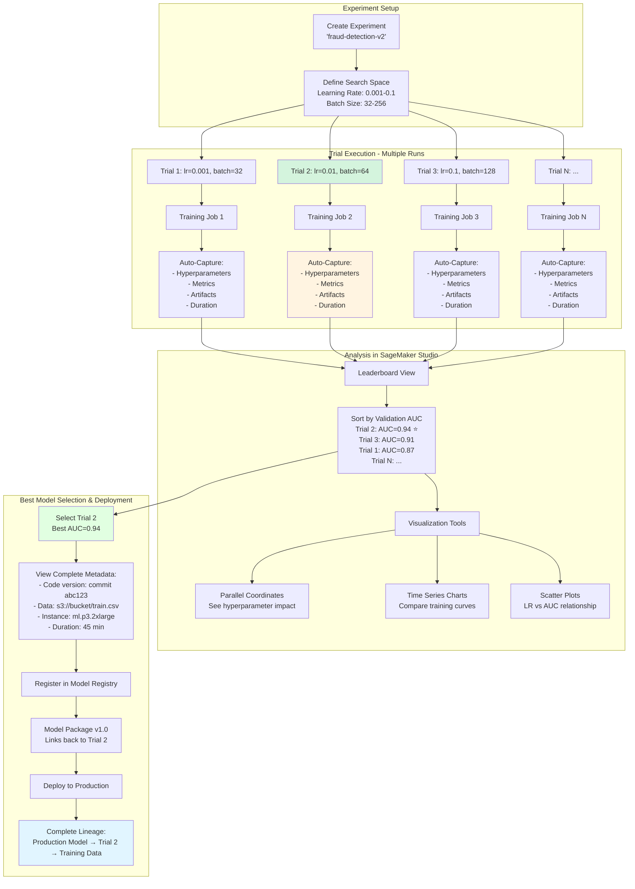
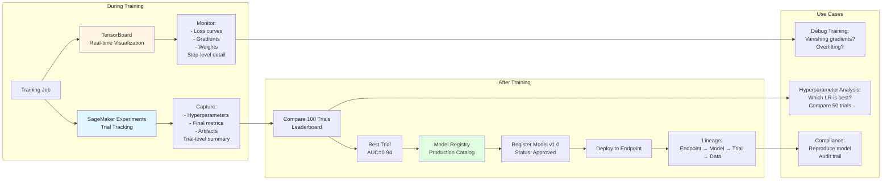

# MLOps: Experiment Tracking & Versioning

**Tags:** `#core` `#important` `#exam-tip`

## Overview
Experiment tracking helps ML teams organize, compare, and reproduce training runs systematically.

## SageMaker Experiments `#exam-tip`

**Purpose:** Track, organize, and compare machine learning experiments systematically.

**Key Concept:** Helps answer "Which hyperparameters produced the best model?" by organizing all training runs.

### Hierarchy Structure

```
Experiment
  └── Trial (Training Run 1)
      ├── Trial Component (Training)
      ├── Trial Component (Processing)
      └── Trial Component (Evaluation)
  └── Trial (Training Run 2)
      └── ...
```

### SageMaker Experiments Workflow



### Experiments vs TensorBoard vs Model Registry



**Definitions:**
- **Experiment:** High-level container for related trials (e.g., "fraud-detection-model-v2")
- **Trial:** Single training run with specific hyperparameters (e.g., "learning-rate-0.01-run")
- **Trial Component:** Individual step within a trial (training job, processing job, transform job)

**What Gets Tracked Automatically:** `#important`
- **Hyperparameters:** All training parameters
- **Metrics:** Training/validation metrics over time (loss, accuracy, AUC)
- **Input data:** S3 paths to training/validation datasets
- **Output artifacts:** Model location, checkpoints
- **Code:** Git commit hash, entry point script
- **Instance info:** Instance type, instance count
- **Duration:** Start time, end time, training duration
- **Status:** InProgress, Completed, Failed

### How It Works

**Automatic Tracking (Recommended):** `#exam-tip`
```python
from sagemaker.experiments import Run

# Create experiment (once)
experiment_name = "fraud-detection-experiment"

# Each training run creates a trial
with Run(
    experiment_name=experiment_name,
    run_name="lr-0.01-batch-128",
    sagemaker_session=session
) as run:
    # Training happens here
    estimator.fit(inputs)

    # Metrics automatically captured
    # Hyperparameters automatically logged
```

**SageMaker automatically creates:**
- Experiment (if doesn't exist)
- Trial for this run
- Trial components for training job
- Links all metadata

**Manual Tracking (Custom Metrics):**
```python
# Log custom metrics during training
run.log_metric(name="custom_f1_score", value=0.923)
run.log_parameter(name="feature_count", value=150)
run.log_artifact(name="confusion_matrix.png", value="s3://bucket/cm.png")
```

### Key Features

**1. Comparison and Visualization** `#exam-tip`

**SageMaker Studio provides:**
- **Leaderboard view:** Rank all trials by metric (e.g., sort by validation:auc)
- **Parallel coordinates plot:** See hyperparameter effects visually
- **Time series charts:** Compare training curves across trials
- **Scatter plots:** Hyperparameter vs metric relationship

**Use case:** "Which learning rate gave best validation AUC?"
- Filter all trials by metric validation:auc
- Sort descending
- See top trial's hyperparameters instantly

**2. Lineage Tracking**

**Tracks complete data flow:** `#important`
- Input datasets → Processing jobs → Training jobs → Models → Endpoints
- **Forward tracking:** "Which endpoints use this dataset?"
- **Backward tracking:** "Which data created this model?"

**Compliance benefit:** Audit trail for regulatory requirements (GDPR, HIPAA)

**3. Search and Filter**

**Search capabilities:**
- Find trials by hyperparameter values
- Filter by metric thresholds (e.g., "AUC > 0.90")
- Search by date range
- Filter by status (Completed, Failed)

**Example queries:**
- "All trials with learning_rate < 0.01"
- "Trials from last week with F1 > 0.85"
- "Failed trials to debug"

**4. Integration with Other Services** `#exam-tip`

**Works with:**
- **SageMaker Training Jobs** - Automatic trial creation
- **SageMaker Processing Jobs** - Track data preprocessing
- **SageMaker Autopilot** - All AutoML trials captured
- **SageMaker Pipelines** - Link pipeline executions to experiments
- **Model Registry** - Connect best trial to registered model

### Use Cases `#exam-tip`

**1. Hyperparameter Tuning Analysis**
- **Problem:** Ran 50 HPO jobs, need to understand which parameters matter
- **Solution:** SageMaker Experiments tracks all 50 trials
- **Benefit:** Visualize learning_rate vs accuracy, see patterns

**2. Team Collaboration**
- **Problem:** Multiple data scientists training models, need to share results
- **Solution:** All trials in shared experiment, team sees all results
- **Benefit:** Avoid duplicate work, build on best results

**3. Model Reproducibility**
- **Problem:** Model from 3 months ago, need exact configuration
- **Solution:** Experiments captured code, data, hyperparameters
- **Benefit:** Re-create exact model for compliance/debugging

**4. A/B Testing History**
- **Problem:** Testing multiple model versions in production
- **Solution:** Link production variants to experiment trials
- **Benefit:** Trace production model back to training run

**5. Audit and Compliance**
- **Problem:** Regulatory requirement to show model development process
- **Solution:** Experiments provide complete lineage and audit trail
- **Benefit:** Pass audits, demonstrate due diligence

### Best Practices `#exam-tip`

**1. Naming Conventions**
```
Experiment: {project}-{model-type}-{version}
Example: "fraud-detection-xgboost-v2"

Trial: {hyperparams-summary}-{date}
Example: "lr-0.01-depth-5-2025-01-15"
```

**2. Metric Logging**
- **Log validation metrics** (not just training) - Use for comparison
- **Log business metrics** if relevant (e.g., cost per prediction)
- **Use consistent naming** across trials (e.g., always "val_auc", not sometimes "validation_auc")

**3. Organization**
- **One experiment per model type/problem**
- **New experiment for major changes** (new algorithm, new features)
- **Group related trials** (e.g., all hyperparameter tuning trials)

**4. Cleanup**
- **Archive old experiments** after model deployment
- **Delete failed trials** after debugging (reduce clutter)
- **Keep production model trials** indefinitely for audit

### Experiments vs Model Registry `#exam-tip`

**Key Difference:**

| Aspect | SageMaker Experiments | Model Registry |
|--------|----------------------|----------------|
| **Purpose** | Track all training runs | Catalog production-ready models |
| **Scope** | Development phase | Deployment phase |
| **Content** | All trials (good and bad) | Only approved models |
| **When** | During experimentation | After model finalized |
| **Metrics** | Training/validation metrics | Production performance metrics |
| **Approval** | No approval workflow | Approval workflow (Pending/Approved/Rejected) |

**Workflow:** `#important`
1. **Experiments:** Run 100 trials, track all metrics
2. **Select best:** Trial #47 has best validation AUC
3. **Register:** Create model package in Model Registry from Trial #47
4. **Approve:** Model Registry approves for production
5. **Deploy:** Deploy approved model to endpoint
6. **Link back:** Can trace production model back to Trial #47 in Experiments

**Exam Scenario:** `#exam-tip`
- **"Track multiple training runs?"** → SageMaker Experiments
- **"Organize production models?"** → Model Registry
- **"Compare hyperparameter combinations?"** → SageMaker Experiments
- **"Approval workflow before deployment?"** → Model Registry

### Pricing `#exam-tip`

**SageMaker Experiments is FREE**
- No additional charge beyond training costs
- Storage costs for metrics/metadata (minimal, fractions of a cent)
- **Exam note:** Cost-free way to improve ML workflow

### Limitations

- **Max 50,000 trials per experiment** (very high, rarely hit)
- **Metrics logged every 5 seconds minimum** (prevent spam)
- **Artifact size limit:** 5GB per trial component

## TensorBoard `#exam-tip`

**Purpose:** Visualize training metrics, model graphs, and debugging information in real-time.

**Key Concept:** Open-source visualization tool (from TensorFlow) that provides rich, interactive dashboards for monitoring ML training.

### What TensorBoard Provides

**Visualization Types:**
- **Scalars:** Training/validation loss, accuracy, metrics over time (line charts)
- **Histograms:** Weight and bias distributions across training
- **Graphs:** Model architecture visualization
- **Images:** View input images and model outputs (for vision models)
- **Distributions:** Statistical distributions of tensors
- **Embeddings:** 3D visualization of embeddings (t-SNE, PCA)
- **Text/Audio:** Preview text and audio samples (for NLP/audio models)

**Common Uses:** `#exam-tip`
1. **Monitor training progress** - Watch loss decrease in real-time
2. **Compare training runs** - Overlay multiple experiments
3. **Debug issues** - Identify vanishing gradients, exploding weights
4. **Validate model** - Check if model is learning or overfitting
5. **Hyperparameter analysis** - Compare different configurations

### TensorBoard with SageMaker `#important`

**Integration Methods:**

**1. Training Job Output (Recommended)** `#exam-tip`
```python
from sagemaker.tensorflow import TensorFlow

estimator = TensorFlow(
    entry_point='train.py',
    role=role,
    instance_type='ml.p3.2xlarge',
    framework_version='2.12',
    # Enable TensorBoard logging
    tensorboard_output_config={
        'LocalPath': '/opt/ml/output/tensorboard',  # Inside container
        'S3OutputPath': 's3://bucket/tensorboard-logs'  # Upload to S3
    }
)

estimator.fit({'training': s3_data})
```

**In training script (train.py):**
```python
import tensorflow as tf

# TensorBoard callback
tensorboard_callback = tf.keras.callbacks.TensorBoard(
    log_dir='/opt/ml/output/tensorboard',
    histogram_freq=1,
    write_graph=True
)

model.fit(
    x_train, y_train,
    callbacks=[tensorboard_callback],
    epochs=10
)
```

**Result:** Logs automatically uploaded to S3 during/after training

**2. SageMaker Studio Integration** `#exam-tip`
- **View TensorBoard directly in Studio** - No separate installation needed
- **Launch from Studio UI** - Right-click training job → "Open TensorBoard"
- **Automatic S3 sync** - Studio reads logs from S3
- **Multi-job comparison** - Compare multiple training jobs side-by-side

**Steps:**
1. Training job writes TensorBoard logs to S3
2. Open SageMaker Studio
3. Navigate to training job
4. Click "Open TensorBoard"
5. Studio launches TensorBoard visualization

**3. SageMaker Debugger Integration** `#exam-tip`

**SageMaker Debugger + TensorBoard:**
```python
from sagemaker.debugger import TensorBoardOutputConfig

tensorboard_config = TensorBoardOutputConfig(
    s3_output_path='s3://bucket/debugger-tensorboard',
    container_local_output_path='/opt/ml/output/tensorboard'
)

estimator = TensorFlow(
    entry_point='train.py',
    role=role,
    instance_type='ml.p3.2xlarge',
    tensorboard_output_config=tensorboard_config,
    # Debugger automatically captures tensors
    debugger_hook_config=debugger_config
)
```

**What Debugger adds to TensorBoard:**
- **Tensor distributions** - Weights, gradients, activations
- **System metrics** - CPU, GPU, memory utilization
- **Debugging insights** - Vanishing gradients, overfitting detection

### Key Features for Exam `#exam-tip`

**1. Real-time Monitoring**
- **Watch training live** - See metrics update every few seconds
- **Catch issues early** - Stop training if loss explodes
- **No code changes** - Works with existing TensorFlow/PyTorch code

**2. Multi-run Comparison** `#important`
- **Overlay multiple runs** - Compare learning rates visually
- **Color-coded lines** - Each run gets unique color
- **Filter by run** - Show/hide specific experiments
- **Use case:** "Which learning rate converges fastest?"

**3. Histogram Analysis**
- **Weight distributions** - Check if weights updating properly
- **Gradient flow** - Ensure gradients not vanishing/exploding
- **Activation patterns** - Verify neurons firing correctly

**4. Framework Support**
- **TensorFlow:** Native support (built-in)
- **PyTorch:** Via `torch.utils.tensorboard`
- **MXNet:** Via MXBoard
- **XGBoost:** Via custom logging

### TensorBoard vs SageMaker Experiments `#exam-tip`

**Key Differences:**

| Aspect | TensorBoard | SageMaker Experiments |
|--------|-------------|----------------------|
| **Primary purpose** | Visualize training details | Track trials and organize experiments |
| **Granularity** | Step-level (every batch) | Epoch/trial-level (aggregated) |
| **Best for** | Debugging, real-time monitoring | Comparing hyperparameters, organizing runs |
| **Visualization** | Rich graphs, histograms, embeddings | Tables, leaderboards, basic plots |
| **Storage** | Local files, S3 | SageMaker metadata store |
| **Integration** | Framework-specific (TensorFlow, PyTorch) | Framework-agnostic (works with any) |
| **Use during** | Training (real-time) | After training (analysis) |
| **Typical user** | ML engineer debugging model | Data scientist comparing trials |

**When to use what:** `#important`

**Use TensorBoard when:**
- Need detailed training visualization (loss curves, gradients)
- Debugging training issues (vanishing gradients, poor convergence)
- Want real-time monitoring during training
- Analyzing model architecture and tensor distributions
- Working with TensorFlow/PyTorch

**Use SageMaker Experiments when:**
- Comparing many hyperparameter combinations
- Organizing team experiments
- Need structured trial tracking
- Want searchable experiment catalog
- Building audit trail for compliance

**Use BOTH together:** `#exam-tip`
- **TensorBoard** for detailed debugging and real-time monitoring
- **SageMaker Experiments** for high-level trial organization and comparison
- **Workflow:**
  1. Run training with both enabled
  2. Watch TensorBoard during training (catch issues early)
  3. After training, use Experiments to compare with other trials
  4. Select best trial, register in Model Registry

### Use Cases `#exam-tip`

**1. Debugging Training Issues**
- **Problem:** Loss not decreasing, suspect vanishing gradients
- **Solution:** TensorBoard histogram view shows gradients → near zero
- **Action:** Increase learning rate or change activation function

**2. Comparing Learning Rates**
- **Problem:** Which learning rate (0.001, 0.01, 0.1) works best?
- **Solution:** Run 3 training jobs, all log to TensorBoard
- **Benefit:** Overlay 3 loss curves, see 0.01 converges fastest

**3. Real-time Training Monitoring**
- **Problem:** Training takes 4 hours, want to check progress
- **Solution:** Open TensorBoard in Studio mid-training
- **Benefit:** See current loss, decide if training is progressing

**4. Model Architecture Validation**
- **Problem:** Complex model, want to verify architecture correct
- **Solution:** TensorBoard Graph view shows model structure
- **Benefit:** Catch errors before long training run

**5. Overfitting Detection**
- **Problem:** Model might be overfitting
- **Solution:** TensorBoard shows training vs validation loss diverging
- **Action:** Add regularization or early stopping

### Best Practices `#exam-tip`

**1. Always Enable TensorBoard** - Minimal overhead, huge benefit
```python
# Add to all training jobs
tensorboard_output_config={
    'S3OutputPath': 's3://bucket/tensorboard-logs'
}
```

**2. Organize Logs by Experiment**
```
s3://bucket/tensorboard/
  └── fraud-detection/
      ├── lr-0.001/
      ├── lr-0.01/
      └── lr-0.1/
```

**3. Log Both Training and Validation Metrics**
```python
# Log separate scalars for train/val
tf.summary.scalar('loss/train', train_loss, step=epoch)
tf.summary.scalar('loss/validation', val_loss, step=epoch)
```

**4. Use Descriptive Run Names**
- ❌ Bad: "run1", "run2", "run3"
- ✅ Good: "lr-0.01-batch-128", "lr-0.1-batch-64"

**5. Clean Up Old Logs**
- TensorBoard logs accumulate quickly
- Use S3 lifecycle policies to archive/delete old runs
- Keep production model logs indefinitely

### Limitations `#exam-tip`

- **Framework-specific:** Best with TensorFlow, requires extra setup for PyTorch/MXNet
- **Large files:** Detailed logging (histograms) creates large logs
- **Not a database:** Doesn't support querying like Experiments does
- **Manual comparison:** Must manually select runs to compare

### Pricing

**TensorBoard itself is FREE** (open-source)
- **Only costs:** S3 storage for logs (minimal, usually cents)
- **Studio integration:** No extra charge
- **Data transfer:** Standard S3 rates if downloading logs

### Exam Scenarios `#exam-tip`

| Scenario | Solution |
|----------|----------|
| "Visualize training loss in real-time?" | **TensorBoard** (with Studio integration) |
| "Debug vanishing gradients?" | **TensorBoard** (histogram view) |
| "Compare 50 hyperparameter trials?" | **SageMaker Experiments** (better for many trials) |
| "View model architecture?" | **TensorBoard** (graph view) |
| "Track which dataset produced best model?" | **SageMaker Experiments** (lineage tracking) |
| "Monitor training from Studio?" | **TensorBoard in Studio** |
| "Overlay 3 learning rate experiments?" | **TensorBoard** (multi-run comparison) |

**Key Exam Distinction:** `#important`
- **"Visualize/debug training details"** → TensorBoard
- **"Organize/compare many experiments"** → SageMaker Experiments
- **"Both together"** → Best practice for comprehensive ML workflow

## ML Lineage Tracking `#important` `#exam-tip`

**Purpose:** Automatically track complete data flow from raw data to deployed models, creating an audit trail for compliance, debugging, and reproducibility.

**Key Concept:** Answer critical questions:
- **Forward tracking:** "Which models/endpoints use this dataset?" (impact analysis)
- **Backward tracking:** "Which data was used to train this production model?" (compliance, debugging)

**Why It Matters for Exam:**
- **Compliance:** GDPR, HIPAA, financial regulations require audit trails
- **Model governance:** Track model provenance for regulatory approval
- **Debugging:** Trace production issues back to training data
- **Reproducibility:** Re-create models with exact data/code versions

### What Is Tracked Automatically `#important`

**Lineage Entities (Artifacts):**

| Entity Type | Description | Examples |
|------------|-------------|----------|
| **Data Sources** | Input datasets | S3 objects, Athena tables, Feature Store feature groups |
| **Processing Jobs** | Data transformations | SageMaker Processing, Glue jobs |
| **Training Jobs** | Model training | SageMaker training jobs, Autopilot trials |
| **Models** | Trained model artifacts | Model packages in Model Registry |
| **Transform Jobs** | Batch inference | Batch Transform jobs |
| **Endpoints** | Real-time inference | SageMaker endpoints |
| **Pipeline Executions** | MLOps workflows | SageMaker Pipelines runs |
| **Experiments/Trials** | Experiment tracking | SageMaker Experiments trials |

**Relationships Tracked:**
```
Raw Data (S3)
    ↓ (input to)
Processing Job
    ↓ (produces)
Processed Data (S3)
    ↓ (input to)
Training Job
    ↓ (produces)
Model Artifact (S3)
    ↓ (registered as)
Model Package (Registry)
    ↓ (deployed to)
Endpoint (Production)
```

### How Lineage Tracking Works

**Automatic Capture (No Code Changes):** `#exam-tip`

SageMaker **automatically creates lineage** when you use SageMaker services:

```python
# No special code needed - lineage captured automatically
from sagemaker.sklearn import SKLearn

# 1. Training job (automatically tracked)
estimator = SKLearn(
    entry_point='train.py',
    role=role,
    instance_type='ml.m5.xlarge'
)

# Lineage automatically captures:
# - Input data: s3://bucket/train.csv
# - Training job ARN
# - Output model: s3://bucket/model.tar.gz
estimator.fit({'training': 's3://bucket/train.csv'})

# 2. Register model (automatically tracked)
from sagemaker.model import Model

model = estimator.create_model()
model_package = model.register(
    model_package_group_name='fraud-detection',
    approval_status='Approved'
)
# Lineage links: Training Job → Model Package

# 3. Deploy endpoint (automatically tracked)
predictor = model.deploy(
    initial_instance_count=1,
    instance_type='ml.m5.xlarge'
)
# Lineage links: Model Package → Endpoint
```

**Result:** Complete chain automatically created:
```
s3://bucket/train.csv → Training Job → s3://bucket/model.tar.gz → Model Package → Endpoint
```

**Manual Annotation (Custom Artifacts):** `#exam-tip`

For custom workflows outside SageMaker:

```python
from sagemaker.lineage import context, artifact, association

# Create custom artifact (e.g., external data source)
input_artifact = artifact.Artifact.create(
    artifact_name='external-database-export',
    artifact_type='DataSet',
    source_uri='rds://my-database/table/export-2025-01-15.csv',
    properties={'rows': 1000000, 'features': 50}
)

# Create training context
training_context = context.Context.create(
    context_name='custom-training-job',
    context_type='Training',
    source_uri='arn:aws:custom-training:us-east-1:123456789012:job/abc'
)

# Link artifact to context (create association)
association.Association.create(
    source_arn=input_artifact.artifact_arn,
    destination_arn=training_context.context_arn,
    association_type='ContributedTo'
)
```

**Use case:** Custom training outside SageMaker, external data sources, third-party tools

### Querying Lineage `#important` `#exam-tip`

**1. Forward Tracking (Impact Analysis)**

**Question:** "If I update this dataset, which models will be affected?"

```python
from sagemaker.lineage.query import LineageQuery

# Find all artifacts downstream from a dataset
query = LineageQuery(sagemaker_session=session)

# Start from dataset
dataset_artifact_arn = 'arn:aws:sagemaker:region:account:artifact/dataset-v1'

# Query forward (what uses this dataset?)
lineage = query.query(
    start_arns=[dataset_artifact_arn],
    direction='Descendants',  # Forward tracking
    include_edges=True
)

# Result: dataset → processing job → training job → model → endpoint
for vertex in lineage.vertices:
    print(f"{vertex.arn} ({vertex.lineage_type})")
```

**Output example:**
```
arn:aws:sagemaker:region:account:artifact/dataset-v1 (DataSet)
    ↓
arn:aws:sagemaker:region:account:processing-job/preprocess-123 (ProcessingJob)
    ↓
arn:aws:sagemaker:region:account:training-job/train-456 (TrainingJob)
    ↓
arn:aws:sagemaker:region:account:model-package/fraud-v1.0 (ModelPackage)
    ↓
arn:aws:sagemaker:region:account:endpoint/fraud-prod (Endpoint)
```

**Use case:** "Need to retrain all models if dataset changes"

**2. Backward Tracking (Compliance, Debugging)** `#exam-tip`

**Question:** "Which exact data was used to train this production model?"

```python
# Start from production endpoint
endpoint_arn = 'arn:aws:sagemaker:region:account:endpoint/fraud-prod'

# Query backward (what created this endpoint?)
lineage = query.query(
    start_arns=[endpoint_arn],
    direction='Ascendants',  # Backward tracking
    include_edges=True
)

# Result: endpoint → model → training job → dataset
for vertex in lineage.vertices:
    print(f"{vertex.arn} ({vertex.lineage_type})")
    # Can access properties: creation_time, source_uri, etc.
```

**Output example:**
```
arn:aws:sagemaker:region:account:endpoint/fraud-prod (Endpoint)
    ↑
arn:aws:sagemaker:region:account:model-package/fraud-v1.0 (ModelPackage)
    ↑
arn:aws:sagemaker:region:account:training-job/train-456 (TrainingJob)
    ↑
arn:aws:sagemaker:region:account:artifact/train-data-2025-01-01.csv (DataSet)
```

**Use case:** Regulatory audit asks "Prove which data trained this model"

**3. SageMaker Studio Lineage Graph** `#exam-tip`

**Visual lineage in Studio UI:**
1. Open SageMaker Studio
2. Navigate to model or endpoint
3. Click "Lineage" tab
4. **Interactive graph** shows complete lineage:
   - Click node to see details (hyperparameters, metrics, timestamps)
   - Trace forward/backward visually
   - Export graph for reports

**Exam note:** Studio provides **no-code lineage exploration** for less technical users

### Integration with Other Services `#exam-tip`

**1. SageMaker Experiments**

**How they work together:**
- **Experiments track trials** (what you tried)
- **Lineage tracks data flow** (what was used/produced)
- **Link:** Each trial is a lineage entity

```python
# Experiment trial automatically has lineage
with Run(experiment_name='fraud-detection', run_name='trial-1') as run:
    estimator.fit(inputs)
    # Lineage automatically links:
    # Trial → Training Job → Data → Model
```

**Benefit:** Can query "Which trials used dataset X?" or "Which data did best trial use?"

**2. Model Registry** `#important`

**Lineage connects registry to training:**

```python
# Register model
model_package = model.register(
    model_package_group_name='fraud-detection',
    approval_status='PendingManualApproval'
)

# Lineage automatically captured:
# Training Job → Model Package (Registry)

# Later, query which training job created this model package
lineage = query.query(
    start_arns=[model_package.model_package_arn],
    direction='Ascendants'
)
# Returns: Training job, input data, hyperparameters, code version
```

**Compliance benefit:** Model Registry approval + Lineage = complete audit trail

**3. SageMaker Pipelines** `#exam-tip`

**Pipeline executions are lineage entities:**

```python
# Pipeline execution
from sagemaker.workflow.pipeline import Pipeline

pipeline = Pipeline(
    name='fraud-detection-pipeline',
    steps=[processing_step, training_step, register_step, deploy_step]
)

execution = pipeline.start()

# Lineage automatically captures ENTIRE pipeline:
# - Pipeline execution ARN
# - Each step (processing, training, registration)
# - Inputs/outputs at each step
# - Final deployed endpoint

# Query: "Which pipeline execution created this endpoint?"
```

**Benefit:** One lineage query traces back through entire MLOps workflow

**4. Feature Store** `#exam-tip`

**Feature groups are lineage entities:**

```python
# Training job uses feature group
estimator.fit({
    'training': 'arn:aws:sagemaker:region:account:feature-group/customer-features'
})

# Lineage automatically captures:
# Feature Group → Training Job → Model

# Query: "Which models use this feature?"
# Query: "Which feature group versions trained this model?"
```

**Compliance benefit:** Track which features contributed to model decisions (GDPR, fairness)

### Use Cases `#exam-tip`

**1. Regulatory Compliance (GDPR, HIPAA, Finance)** `#important`

**Requirement:** "Prove which patient data was used to train this diagnostic model"

**Solution:**
```python
# Auditor asks about production model
model_arn = 'arn:aws:sagemaker:region:account:model-package/diagnosis-v2.0'

# Backward lineage query
lineage = query.query(start_arns=[model_arn], direction='Ascendants')

# Returns:
# - Exact S3 paths of training data (with timestamps)
# - Processing jobs (anonymization, masking applied)
# - Training job (hyperparameters, code version from Git)
# - Model evaluation metrics
```

**Result:** Complete audit trail showing data governance compliance

**2. Model Debugging (Performance Issues)** `#exam-tip`

**Problem:** "Production model accuracy dropped from 95% to 85%"

**Solution:**
```python
# Trace back to find what changed
endpoint_arn = 'arn:aws:sagemaker:region:account:endpoint/production'

lineage = query.query(start_arns=[endpoint_arn], direction='Ascendants')

# Discover:
# - New model deployed 2 weeks ago
# - Trained on updated dataset (data drift?)
# - Different hyperparameters than previous version
# - Can compare to old model's lineage
```

**Action:** Identify root cause (data quality issue, code bug, hyperparameter change)

**3. Data Impact Analysis** `#important`

**Scenario:** "Need to delete customer data due to GDPR request"

**Question:** "Which models were trained on this customer's data?"

**Solution:**
```python
# Customer ID 12345 in dataset s3://bucket/train-2024-12.csv
dataset_arn = 'arn:aws:sagemaker:region:account:artifact/train-2024-12'

# Forward lineage query
lineage = query.query(start_arns=[dataset_arn], direction='Descendants')

# Discover:
# - 3 models trained on this data
# - 2 deployed to production endpoints
# - 1 in Model Registry (approved)
```

**Action:** Retrain/replace all affected models to comply with GDPR deletion

**4. Model Reproducibility** `#exam-tip`

**Requirement:** "Re-create exact model from 6 months ago for A/B test"

**Solution:**
```python
# Find old model in registry
old_model_arn = 'arn:aws:sagemaker:region:account:model-package/fraud-v1.0'

lineage = query.query(start_arns=[old_model_arn], direction='Ascendants')

# Lineage returns:
# - Exact S3 path: s3://bucket/train-2024-07-15.csv
# - Training job hyperparameters
# - Code version (Git commit hash)
# - Instance type used
# - Processing steps applied

# Re-run with EXACT same inputs → reproduce model
```

**5. Team Collaboration & Handoffs**

**Scenario:** "Data scientist A leaves, data scientist B takes over model"

**Solution:**
```python
# Data scientist B queries project lineage
lineage = query.query(
    start_arns=[model_arn],
    direction='Both'  # Forward and backward
)

# Instantly understand:
# - Which data sources used
# - All processing steps
# - Training configurations tried
# - Current production deployments
# - Downstream dependencies
```

**Benefit:** Reduce onboarding time, avoid breaking production

### Lineage API Reference `#hands-on`

**Key methods:**

```python
from sagemaker.lineage.query import LineageQuery
from sagemaker.lineage import artifact, context, association

# 1. Query lineage
query = LineageQuery(sagemaker_session=session)
lineage = query.query(
    start_arns=['arn:aws:sagemaker:...'],
    direction='Ascendants',  # or 'Descendants', 'Both'
    include_edges=True  # Include relationships
)

# 2. Create custom artifact
artifact.Artifact.create(
    artifact_name='my-dataset',
    artifact_type='DataSet',
    source_uri='s3://bucket/data.csv',
    properties={'version': '1.0', 'rows': 1000000}
)

# 3. Create context (grouping)
context.Context.create(
    context_name='my-training',
    context_type='Training',
    source_uri='arn:aws:sagemaker:region:account:training-job/abc'
)

# 4. Create association (link artifacts)
association.Association.create(
    source_arn=artifact_arn,
    destination_arn=context_arn,
    association_type='ContributedTo'  # or 'Produced', 'DerivedFrom'
)

# 5. List artifacts
artifacts = artifact.Artifact.list(
    source_uri='s3://bucket/data.csv',
    sort_by='CreationTime',
    sort_order='Descending'
)
```

### Best Practices `#exam-tip`

**1. Enable Automatic Lineage**
- ✅ Use SageMaker services (automatic tracking)
- ✅ No code changes needed for basic lineage
- ❌ Don't disable lineage (always beneficial)

**2. Annotate Custom Artifacts**
```python
# Add metadata to artifacts for better tracking
artifact.Artifact.create(
    artifact_name='customer-data-v2',
    artifact_type='DataSet',
    source_uri='s3://bucket/data.csv',
    properties={
        'version': '2.0',
        'creation_date': '2025-01-15',
        'rows': 1000000,
        'features': 50,
        'owner': 'data-team@company.com',
        'pii_removed': 'true'  # Compliance flag
    }
)
```

**3. Query Lineage Regularly**
- Before deploying: Check which data was used
- After issues: Trace back to root cause
- For audits: Generate lineage reports
- For impact analysis: Check downstream dependencies

**4. Integrate with Model Registry**
- Always register models (creates lineage link)
- Use approval workflow (adds governance)
- Tag model packages with business metadata

**5. Document External Artifacts**
- For non-SageMaker data sources, create artifacts manually
- Include source_uri for traceability
- Add properties for context

### Exam Scenarios `#important`

| Scenario | Solution |
|----------|----------|
| "Track which data trained production model?" | **Backward lineage query** from endpoint |
| "Find all models using specific dataset?" | **Forward lineage query** from dataset artifact |
| "Comply with GDPR data deletion request?" | **Lineage** to find all models trained on that data |
| "Reproduce model from 6 months ago?" | **Backward lineage** to get exact data/code/hyperparameters |
| "Audit trail for regulatory compliance?" | **SageMaker Lineage** (automatic capture) |
| "Debug production model performance drop?" | **Lineage** to compare current vs previous model inputs |
| "Prove model fairness for audit?" | **Lineage + SageMaker Clarify** (track bias checks) |
| "Which endpoints will break if I update this dataset?" | **Forward lineage** (impact analysis) |
| "Visualize complete ML workflow?" | **SageMaker Studio Lineage Graph** |
| "Track custom external data sources?" | **Manual artifact creation** + associations |

### Lineage vs Experiments vs Model Registry `#exam-tip`

**How they complement each other:**

| Tool | Purpose | What It Tracks | When to Use |
|------|---------|---------------|-------------|
| **Lineage** | Data flow & provenance | Inputs → Transformations → Outputs | Compliance, debugging, impact analysis |
| **Experiments** | Trial organization | Hyperparameters, metrics, comparisons | Hyperparameter tuning, team collaboration |
| **Model Registry** | Production catalog | Approved models, versions, approvals | Deployment, governance, versioning |

**Together they provide:**
1. **Experiments:** Track all training attempts (good and bad)
2. **Lineage:** Track data flow through best trial
3. **Model Registry:** Catalog approved model from best trial
4. **Complete story:** Experiment → Best Trial → Lineage → Registry → Production Endpoint

### Limitations

- **Lineage retention:** 120 days by default (can be extended with manual artifact creation)
- **Query limits:** Max 100 entities per query result (pagination available)
- **Custom artifacts:** Require manual creation (not automatic)
- **Cross-region:** Lineage is region-specific (no cross-region tracking)

### Pricing

**Lineage tracking is FREE**
- No additional charge for automatic lineage capture
- Storage for lineage metadata included in SageMaker pricing
- Manual artifact creation: Free (minimal storage cost)

**Cost benefit:** Saves hours of manual documentation and debugging

### Exam Tips `#important`

**Key phrases that indicate lineage:**
- ✅ "Track data provenance"
- ✅ "Audit trail"
- ✅ "Compliance requirement"
- ✅ "Which data trained this model?"
- ✅ "Impact analysis"
- ✅ "Reproduce model"
- ✅ "GDPR, HIPAA, regulatory"

**Common exam patterns:**
- **"Prove which data was used"** → Backward lineage query
- **"Find affected models"** → Forward lineage query
- **"Regulatory audit"** → SageMaker Lineage (automatic tracking)
- **"Model reproducibility"** → Lineage + Experiments + Model Registry together

## Related Topics
- [MLOps & Deployment](./mlops-deployment.md) - Deployment strategies, inference optimization
- [MLOps CI/CD](./mlops-cicd.md) - Model Registry, Pipelines, Kubernetes
- [MLOps Monitoring](./mlops-monitoring.md) - Model Monitor, observability
- [Amazon SageMaker](../sagemaker/sagemaker.md)
- [Model Training & Evaluation](../core-ml/model-training-evaluation.md)
