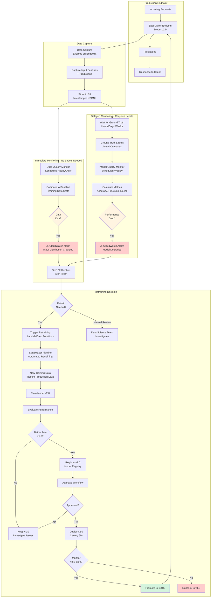
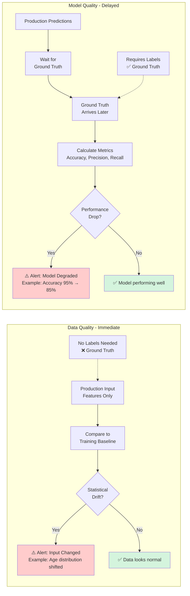

# MLOps: Model Monitoring & Observability

**Tags:** `#core` `#important` `#exam-tip`

## Overview
Model monitoring ensures ML models continue to perform well in production by detecting data drift, model degradation, and bias.

## Model Monitoring Flow `#important`

### Continuous Monitoring and Retraining Loop



### Data Quality vs Model Quality Monitoring



## SageMaker Model Monitor `#exam-tip`
**Purpose:** Detect model and data quality issues in production

### Data Capture `#exam-tip`
**Purpose:** Capture inference requests and responses for Model Monitor analysis

**Overview:**
- **Prerequisite for Model Monitor** - Must enable data capture on endpoint before monitoring
- Captures input payloads and model predictions in real-time
- Stores captured data in S3 for later analysis
- Required for all Model Monitor types (Data Quality, Model Quality, etc.)

**Configuration:**
```python
DataCaptureConfig = {
    'EnableCapture': True,
    'InitialSamplingPercentage': 100,  # Capture 100% of requests (or lower for high-volume)
    'DestinationS3Uri': 's3://bucket/data-capture',
    'CaptureOptions': [
        {'CaptureMode': 'Input'},   # Capture request payload
        {'CaptureMode': 'Output'}   # Capture model predictions
    ]
}
```

**Key Parameters:**
- **InitialSamplingPercentage** - % of requests to capture (1-100)
  - Use 100% for low-volume endpoints
  - Use 20-50% for high-volume to reduce storage costs
- **CaptureMode** - What to capture:
  - `Input` - Request payload sent to endpoint
  - `Output` - Model predictions/responses
  - Both - Recommended for full monitoring capability
- **DestinationS3Uri** - S3 location for captured data

**Captured Data Format:**
```json
{
  "captureData": {
    "endpointInput": {
      "observedContentType": "text/csv",
      "mode": "INPUT",
      "data": "1.5,2.3,4.1,...",
      "encoding": "CSV"
    },
    "endpointOutput": {
      "observedContentType": "text/csv",
      "mode": "OUTPUT",
      "data": "0.92",
      "encoding": "CSV"
    }
  },
  "eventMetadata": {
    "eventId": "unique-id",
    "inferenceTime": "2025-01-15T10:30:00Z"
  }
}
```

**Storage Structure in S3:**
```
s3://bucket/data-capture/
├── 2025/01/15/10/
│   ├── request-1.jsonl
│   ├── request-2.jsonl
│   └── ...
```
- Organized by year/month/day/hour
- JSONL format (one JSON object per line)

**Exam Scenarios:** `#exam-tip`
- **"Enable monitoring on endpoint"** → Must configure DataCaptureConfig first
- **"High request volume, minimize storage costs"** → Lower InitialSamplingPercentage (20-50%)
- **"Monitor both inputs and predictions"** → Capture both Input and Output modes
- **"Data for baseline creation"** → Data Capture provides the production data

**Common Gotchas:** `#gotcha`
- Cannot enable data capture on existing endpoint - must update endpoint configuration
- Captured data stored in S3 incurs storage costs
- Data capture adds minimal latency (<1ms typically)
- Must have both Input and Output capture for Model Quality monitoring

### Monitoring Types

#### 1. Data Quality Monitoring
- **Detects:** Changes in input data distribution
- **Mechanism:** Compares production input features to training baseline (statistical comparison)
- **NO LABELS REQUIRED** - Only looks at input data, not predictions or outcomes
- **Immediate detection** - Identifies issues as soon as data arrives
- **Metrics:** Feature statistics, missing values, data types, distributions
- **Baseline:** Created from training data
- **Alerts:** When production data deviates from baseline (before model even makes predictions)

#### 2. Model Quality Monitoring `#important`
- **Detects:** Model prediction quality degradation
- **Requires:** Ground truth labels (actual outcomes) - **these arrive LATER**
- **Timing mechanism:** Model makes prediction now → Actual outcome known later (hours/days/weeks)
- **Example:**
  - Fraud detection: Predict fraud today → Investigate → Confirm fraud result 3 days later
  - Customer churn: Predict churn in March → Wait 30 days → Know if customer actually churned in April
- **Metrics:** Accuracy, precision, recall, AUC (calculated after ground truth arrives)
- **Use case:** Detect model drift over time (requires patience for ground truth)
- **Key difference from Data Quality:** Data Quality = immediate (no labels needed), Model Quality = delayed (labels required)

#### 3. Bias Drift Monitoring
- **Detects:** Changes in bias metrics over time
- **Integration:** SageMaker Clarify
- **Monitors:** Disparate impact, demographic parity

#### 4. Feature Attribution Drift
- **Detects:** Changes in feature importance
- **Uses:** SHAP values
- **Indicates:** Model behavior changes

### Monitoring Types Comparison `#exam-tip`

| Aspect | Data Quality | Model Quality |
|--------|-------------|---------------|
| **Labels required?** | ❌ No | ✅ Yes (ground truth) |
| **Detection speed** | ⚡ Immediate | ⏳ Delayed (wait for labels) |
| **What it monitors** | Input features only | Prediction accuracy |
| **When to use** | Always (first line of defense) | When ground truth is available |
| **Example alert** | "Age distribution has shifted" | "Accuracy dropped from 95% to 85%" |
| **Cost** | Lower (no labels needed) | Higher (need label collection) |

**Decision Framework:** `#exam-tip`
- **If the question mentions "without labels"** → Data Quality Monitoring
- **If the question asks about "model accuracy degradation"** → Model Quality Monitoring (needs labels)
- **If immediate detection needed** → Data Quality Monitoring
- **Best practice:** Use BOTH - Data Quality alerts you immediately, Model Quality confirms impact

**How It Works:**
1. Create baseline from training data
2. Schedule monitoring jobs (hourly, daily)
3. Compare production data to baseline
4. Generate violations report
5. Alert via CloudWatch/SNS if drift detected

**Exam Scenarios:** `#exam-tip`
- Production data differs from training → **Data Quality Monitor**
- Model accuracy dropping → **Model Quality Monitor** (needs ground truth)
- Check for bias in predictions → **Bias Drift Monitor** (Clarify)

## Monitoring & Observability `#exam-tip`

### CloudWatch Integration
- **Metrics:**
  - Endpoint invocations
  - Model latency (ModelLatency)
  - Instance utilization (CPU, memory, GPU)
  - Error rates (4xx, 5xx)
- **Alarms:** Trigger on threshold violations
- **Dashboards:** Visualize model performance

### CloudWatch Logs
- Training job logs
- Endpoint invocation logs
- Processing job logs
- **Retention:** Configurable (7 days to indefinite)

### AWS X-Ray
- Trace requests through inference pipeline
- Identify bottlenecks
- Debug performance issues

## Cost Optimization `#exam-tip`

### Training Cost Optimization
1. **Managed Spot Training** - 90% savings
2. **Right-size instances** - Don't over-provision
3. **Local mode** - Test on notebook instance first
4. **Checkpoint frequently** - For spot interruptions
5. **Pipe input mode** - Stream data vs downloading

### Inference Cost Optimization
1. **Batch Transform** - For offline predictions
2. **Serverless Inference** - For intermittent traffic
3. **Multi-model endpoints** - Share infrastructure
4. **Auto-scaling** - Scale down during low traffic
5. **Neo optimization** - Reduce instance size needed
6. **Reserved capacity** - For predictable workloads

### Storage Cost Optimization
1. **S3 Intelligent-Tiering** - Auto-move to cheaper tiers
2. **Lifecycle policies** - Delete old model artifacts
3. **Model compression** - Reduce artifact size

## Exam Scenarios Summary `#exam-tip`

| Scenario | Solution |
|----------|----------|
| Detect production data drift | Model Monitor (Data Quality) |
| Model accuracy degrading | Model Monitor (Model Quality) + Retrain |
| A/B test 2 model versions | Endpoint with Production Variants |
| Automate ML workflow | SageMaker Pipelines |
| Version and approve models | Model Registry |
| Deploy to dev/staging/prod | SageMaker Projects + CodePipeline |
| Monitor for bias in production | Model Monitor + Clarify (Bias Drift) |

## Related Topics
- [MLOps & Deployment](./mlops-deployment.md) - Deployment strategies, inference optimization
- [MLOps Experiments & Tracking](./mlops-experiments.md) - SageMaker Experiments, TensorBoard
- [MLOps CI/CD](./mlops-cicd.md) - Model Registry, Pipelines, Kubernetes
- [Amazon SageMaker](../sagemaker/sagemaker.md)
- [SageMaker Clarify](../sagemaker/sagemaker-clarify.md) - Bias detection
- [Security](../security/security.md) - Security best practices
